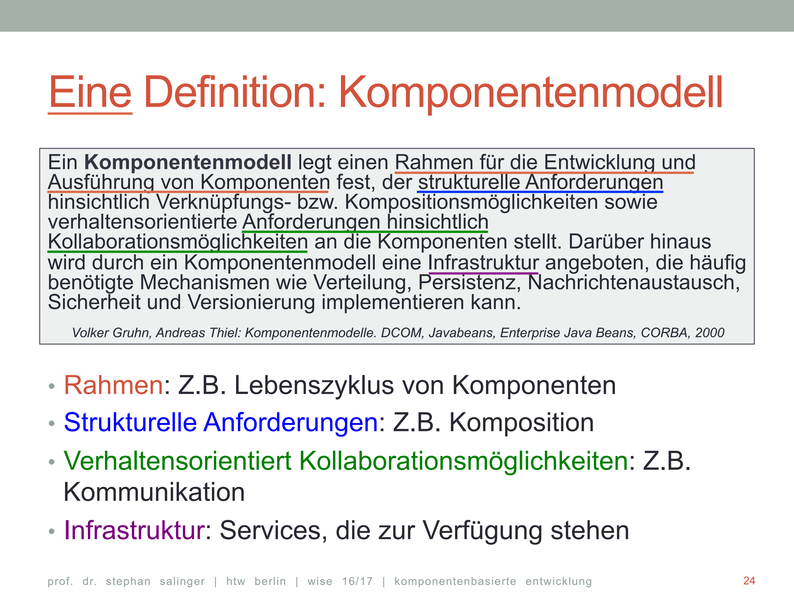

# Komponentenbasierte Entw.

## 01
* Java Platform, Enterprise Edition (JEE)
    * Spezifikation einer Sofwarearchitektur für transaktionsbasierte Ausführungen in Java

* Framework

        Ein Rahmenwerk (framework) ist ein durch den Software-Entwickler [...] erweiterbares System kooperierender Klassen , die einen wiederverwendbaren Entwurf für einen bestimmten Anwendungsbereich implementieren. [...] Im Allgemeinen wird vom Anwender des Rahmenwerkes erwartet, dass er Unterklassen definiert, um das Rahmenwerk zu verwenden [...]. Diese [...] Unterklassen empfangen Botschaften von [...] den Rahmenwerkklassen nach dem Hollywood - Prinzip „ Don‘t call us, we‘ll call you “.

    * Zentrale Aspekte:
        * Ist ein wiederverwendbarer Entwurf
        * Hat eine Implementierung
        * Ist für ein bestimmtes Anwendungsgebiet
        * Wird von Entwicklern erweitert
        * Don't call us, we call you!
            * Das Framework ruft useren Kode auf wobei Bibiliothken Funktionen bereitstellen, die der Entwickler verwendet/aufruft.
        * Wiederverwendbarkeit
        * Sind keine vollständigen Programme, sie müssen erweitert werden.

    * Frage - Antworten
        * Frameworks stellen Programmkode zur Verfügung, der bei seinem Einsatz
verändert werden muss. Es stellt zusätzliche Funktionalitäten zur Verfügung, die vom Entwickler angepasst werden können.
        * Frameworks setzen Entwurfsmuster um.
        * Frameworks können einen hohen Einarbeitungsaufwand voraussetzen.

* JavaServer Faces (JSF)

* MVC - Model View Controller
Unterteilung der Applikation in drei miteinander verbundene Teile:
    * Model:
        * Datenmodell:
            * enhält die Daten
            * von Steuerung und Präsentation unabhängig
            * vom Controller befragt und modifiziert
    * View
        * Präsentation:
            * Befragt das Modell, um seine Darstellung anzupassen
    * Controller
        * Programmsteuerung:
            * Verarbeitung der Eingaben
            * Kommunikation dieser an das Modell

 * Model 2 - MVC für Java-Webanwendungen
 
     * JavaBeans
         1. Default constructor
         2. Serialisierbar
         3. Public Getter/Setter

* Java-Annotations
    * Metadaten im Quelltext, z.B. Klassen (mit @)  
        @Deprecated  
        public class A{}
    * werden z.B. vom Compiler ausgewertet um Warnungen zu erzeugen

* Session
    * Bezeichnet eine stehende Verbindung vom Client zu einem Server
    * Beim zustandslosen HTTP kann so etwas nur „emuliert“ werden.

* Entwicklung einer JSF-Applikation
    * Modell entwickeln - JavaBean-Entwickeln
    * Mitgelieferten Controller einsatzfähig machen - Konfiguration
    * View für die Anzeige entwickeln (Facelet-Technologie)
        * XHTML
    
* JavaServerFaces 2.2: Der Controller
    * JSF liefert zwei Konfigurationsdateien um den vorhandenen Controller zu konfigurieren
        * web.xml  
        Welche Anfragen vom Controller bearbeitet/reagiert werden soll.
        * faces-config.xml 
            Legt die Navigation fest.

* Unified Expression Language (EL 2.1)
    * ~! eine JavaScript-ähnlich Programmiersprache
    * kann in Facelets (XHTML) verwendet werden
    * Syntax #{....} -> #{customer.lastName}
    * Verbindet View mit Model -> mit EL auf Managed-Beans zugreifen

* Der View
    * Sind definiert in Facelets
    * Beinhalten Tags der Facelet-HTML-Tag-Bibliothek
    * Gehören zum JSF-Framework
* ~! Praktischer Ablauf ab s30 bis s35

---
## 02

* Frage - Antwort
    * Sw-Produkte schneller am Markt zu positionieren
    * Geld bei der Sw-Entwicklung zu sparen
    * Die Qualität von Software zu verbessern.
* Faktoren des Erfolges resultierend aus der Definition von Komponentenbasierter Entwicklung
    * Time-to-Market
        * Idee : Die Wiederverwendung einer Komponente benötigt weniger Zeit als ihre Entwicklung.
            * Systeme können schneller entwickelt werden.
    * Arbeits-Produktivität
        * Idee : Wiederverwendung ex. Lösungen statt „Neuerfindung“:
            * Es kann mehr Software pro Person entwickelt werden.
            * Entwicklungskosten werden reduziert.
            * Wettbewerbsfähigkeit wird erhöht.
    * Wartung
        * Idee: Komponentenbasierte Entwicklung setzt einen „guten“ modularen Entwurf (modular design) voraus.
            * Verständlich (comprehensible)
            * Wartbar (maintainable)
            * Flexibel (flexible)
    * Qualität
        * Idee: Zusammensetzen eines Systems aus einer Sammlung qualitativ hochwertiger Komponenten führt zu einem qualitativ hochwertigen System.
            * Die Kosten für das Erreichen der hohen Qualität der Komponenten amortisiert sich durch den wiederholten Einsatz.
            * Der wiederholte Einsatz von Komponenten verbessert ihre Qualität.
            * Wahrscheinlichkeit Fehler zu finden/beseitigen zu müssen sinkt.
* Komponenten (Definition)
    * Teil eines Systems
    * Besitzt spezifizierte Schnittstellen
    * Unabhängig einsetzbar
    * keine Abhängigkeit zu anderen Komponenten
    
    

* Komponentenmodell (Definition)

* Elemente eines Komponentenmodells
    * Interfaces von Komponenten
    * Informationen die benötigt werden, Komponenten zu nutzen
    * Verteilung/Installation von Komponenten
    * Zusammenfassung Kerneigenschaften:
        * Spezifiziert Form und Eigenschaften von Komponenten.
        * Legt fest wie Komponenten miteinander sprechen und verbunden werden können.
        * Legt fest, wie die Infrastruktur der Komponenten aussieht.
        * Achtung: Zu einem Komponentenmodell können mehrere Implementierungen existieren.
* Tags und Komponenten
    * Die Tags der XHTML-Seite werden beim Aufruf auf dem Server
        1. in (Instanzen von) Komponenten umgesetzt und
        2. in einem Komponentenbaum angeordnet.
---
## 04

* Cast ->

* Polymorphie ->

    * Konstruktoren werden nicht vererbt
    * Bei der Ausführung eines Konstruktors werden autom. die Konstruktoren der Superklasse ausgeführt.
    * Das System ruft dabei die Std.-Konstruktoren der Superklasse auf
    * Alternativen:
        * Default ergänzen wenn nicht vorhanden
        * mittels super(...) aufrufen
* ~! Typumwandlung s15
* Interfaces
    * Funktionalität für mehrere Klassen bereitstellen
    * Keine Implementierung im Interface
    * Keine Instanzerzeugung möglich
    * Enhält nur Signaturen
    * Variablen müssen Konstanten sein
    * ~! s20
    * Methoden haben immer den Sichtbarkeitesbereich public
* Abstrakte Klassen
    * Kein Instanzerzeugung
    * Enthält abstrakte Methoden (nur Signaturen) und implementierte Methoden
    * Strukturierung des Klassenbaums
* ~! Beispiel Entwurfsproblem s29 bis s37
* Entwurfsmuster Strategy s38 bis s39
* Gründe für Entwurfsmuster
    * Es ist eine Abstraktion
    * Es schont mentale Ressourcen und vereinfacht das Verständnis
    * Es vereinfacht die Kommunikation über Lösungen es Problems
    * Es ermöglicht Wiederverwendung

            "Entwurfsmuster [...] sind Beschreibungen zusammenarbeitender Objekte und Klassen, die maßgeschneidert sind, um ein [...] Entwurfsproblem in einem bestimmten Kontext zu lösen.“
---
## 05
* Entwurfsmuster Singleton +  Sync s19 - s20!
    * Nur eine Instanz eines Objektes
    * Wird genutzt im Bereich Ressourcen-Verwaltung(Caches, Treiber) und Services(Logging)
* DRY-Prinzip
    * Redundanzen vermeiden/reduzieren
    * Code Änderungen werden nur einmal durchgeführt
* Entwurfsmuster statische Fabrik-Methode

    * Vorteile
        * Kohäsion der Klassen => Die Funktioinalitäten sind von einander abgegrenzt(jeder erfüllt nur eine explizite Aufgabe)
        * Wenn ein neues Erzeugungsobjekt hinzukommt, muss lediglich die Fabrik angepasst werden
* Maven

    Definition:
        * Open source
        * Standards-based:Convention over Configuration
            * Stellt Default-Einstellungen zur Verfügung, die je nach Project angepasst werden können.
        * Project management framework : In Maven werden die Prozesse zum Generieren von Applikationen definiert; dies erfolgt deklarativ.
        * Simplifies:
            * Ist modular aufgebaut.
            * Für viele Anwendungen gibt es Plugins, die die eigentliche Aufgabe realisieren.

    * Einheitliche Verzeichnisstruktur
        * Wo und wie werden die Sourcen und das Compilat abgelegt?
        * Wo werden Klassen für das Testen abgelegt?
        * Wo sind Ressourcen (Text-/Konfigurationsfiles, Bilder, etc.) abgelegt?
    * Abhängigkeiten (Dependencies):
        * Welche Bibliotheken in welchen Versionen werden von den Entwicklern genutzt?
        * Wo gibt es die aktuellen Bibliotheken zum Download und welche Abhängigkeiten haben diese wiederum?
        * Wann werden die Bibliotheken genutzt? (Nur zum Testen oder müssen sie vielleicht mit ausgeliefert werden?)
    * Einheitliche Konfiguration der verwendeten Werkzeuge:
        * Welcher Compiler soll verwendet werden und wie wird er konfiguriert?
        * Wie wird die Applikation mit welchen Parametern ausgeführt?
        * Wie soll die ausgelieferte Applikation zusammengebunden werden?
        * Wie soll das Ergebnis der durchgeführten Tests aussehen?
    * Sonst
        * Welche Infrastruktur wird für das Testen und welche für den Produktivbetrieb verwendet?
        * Wie soll die Dokumentation des Projekts aussehen?
        * Welche Schritte sollen nach dem erfolgreichen werden?
        * Erzeugung von Projektinformation: Change Logs,Unit Test Reports, Dokumentation (z.B. Javadoc)

    * pom.xml
        * Enhält Projektkonfigurationen und -informationen.
        * Dient zum Bau des Projektes
    * Repsitories
    
    * Archetypes
        * Projekt-Templates, die die Dateistruktur und die pom.xml, auf den entsprechenden Anwendungsfall zur Verfügung stellen.
        * Bsp: mvn archetype:generate -DarchetypeArtifactId=maven-archetype-webapp
    * Lebenszyklus "Build Lifecycle"
        * Erzeugen der Projektartefakte in aufeinander folgenden Schritten(Goals)-> Zusammengehörige Goals = Plug-Ins(mvn compiler:compile)
            * Das Verhalten von Plug-Ins kann in der pom.xml konfiguriert werden.
        * Die nächst höhere Instanz sind Phasen, die die Abfolgen der Abarbeitung der Goals steuern.
        * Default Live Circle
            * validate: Prüfung, ob eine Projektstruktur gültig und vollständig ist
            * compile: Kompilierung Quellcode
            * test: Ausführung der Tests
            * install: Installation des Softwarepakets im lokalen Maven-Repository
            * deploy: Installation in entfernten Maven-Repositories
---
## 06
* Speichern und Laden von Objekten durch einen eigenen Mechanismus
    * Objekte mit den jeweiligen Abhängigkeiten werden gespeichert
        * Eigenschaften:
            * Markiert durch das Interface java.io.Serializable
            * Schreibt in einen Byte-Strom mittels java.io.ObjectOutputStream Klasse und der darin befindlichen writeObject() Methode.
            * Für die Deserialisierung wird aus der Klasse java.io.ObjectInputStream die Methode readObject() verwendet.
    * De-/Serialisierung ("Save/Load")
        * Ausnahmen werdend durch "private **transient** Image thumbnailImage;" gekennzeichnet:
            * Threads
            * Socket
            * FileInputStream
            * Speicheradressen
            * Passwörter

            Beispiel:
                    class GalleryImage implements Serializable
                    {
                        private Image image;
                        private transient Image thumbnailImage;

                        private void generateThumbnail()
                        {
                            // Generate thumbnail.
                        }

                        private void readObject(ObjectInputStream inputStream)
                                throws IOException, ClassNotFoundException
                        {
                            inputStream.defaultReadObject();
                            generateThumbnail();
                        }    
                    }
            
            * Versionierung / SUID
                * Wird automatisch vergeben und beinhaltet den Hashcode aus Namen, Attributen, Parametern, Sichtbarkeit usw, die in einer UID gespeichert werden.
                * Kann manuell überschrieben werden

                        private static final long serialVersionUID= 1L;
        * Generics
            * Ziel: Dem Compiler mehr Informationen über die Typen zu geben.
            * Als Generics-Variablen können keine primitiven Datentypen verwendet werden. Nur Typvariablen (Integer nicht int)
            
            
            
            * Compiliervorgang:
                * Überprüfung der Typisierung und die damit verbundenen Zuweisungen
                * Erstellung von Java-Bytecode für den Generic-Quellcode-Klasse
